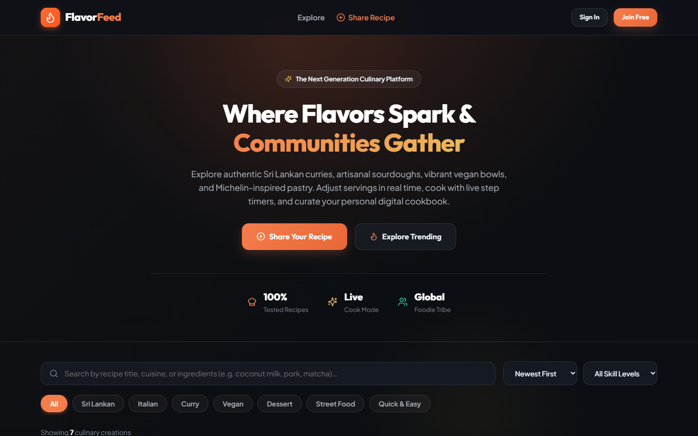
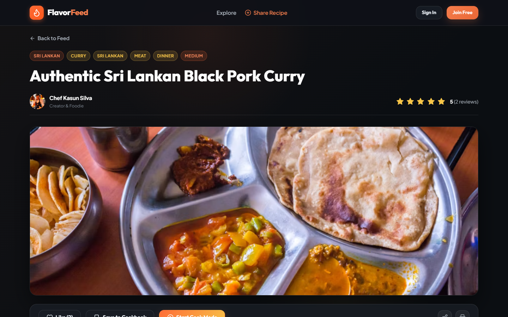
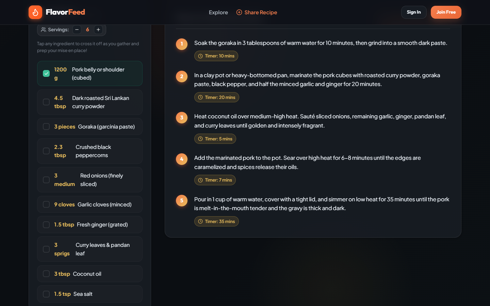
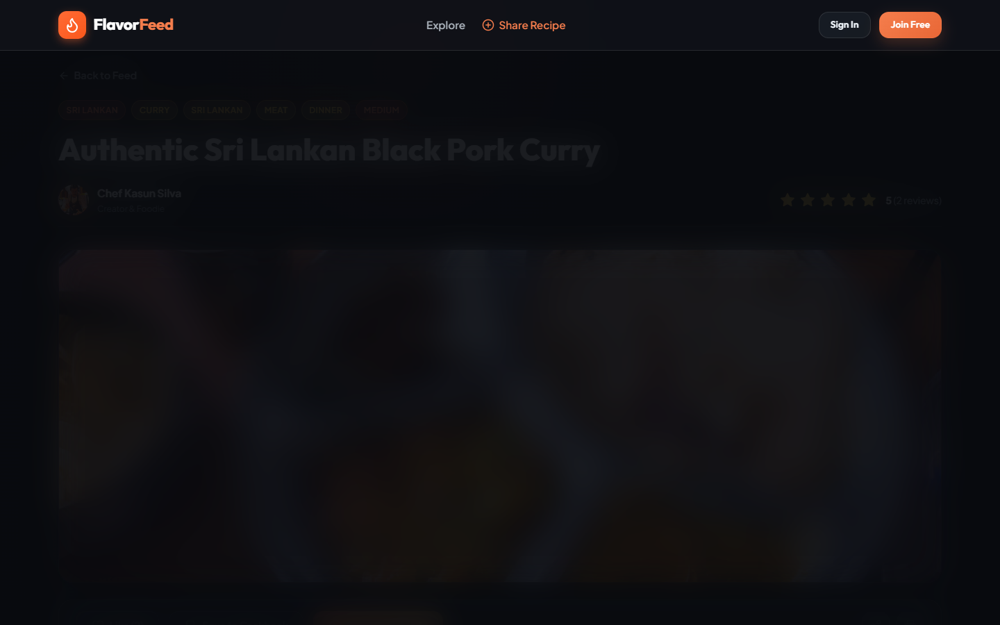
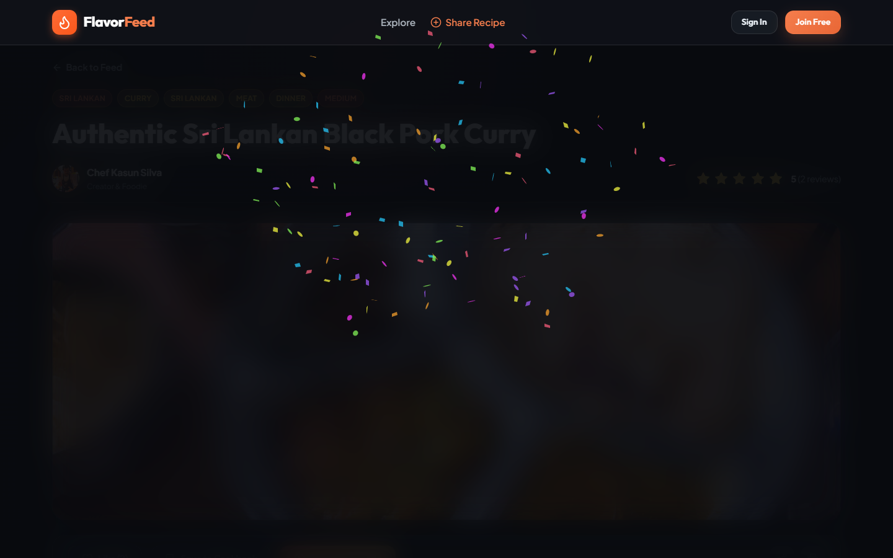
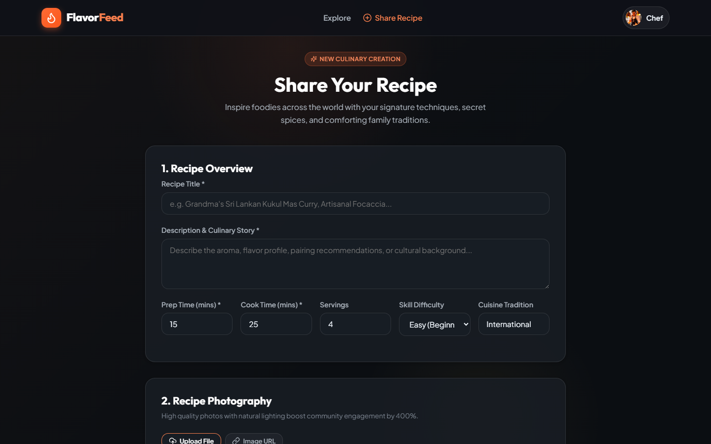
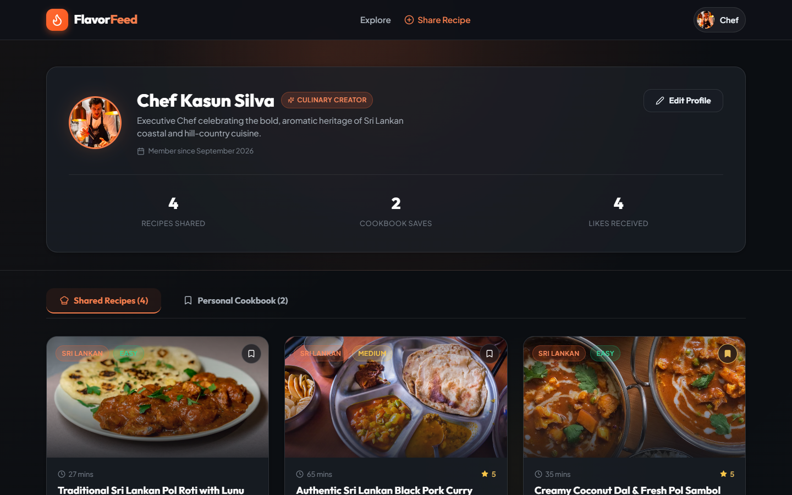
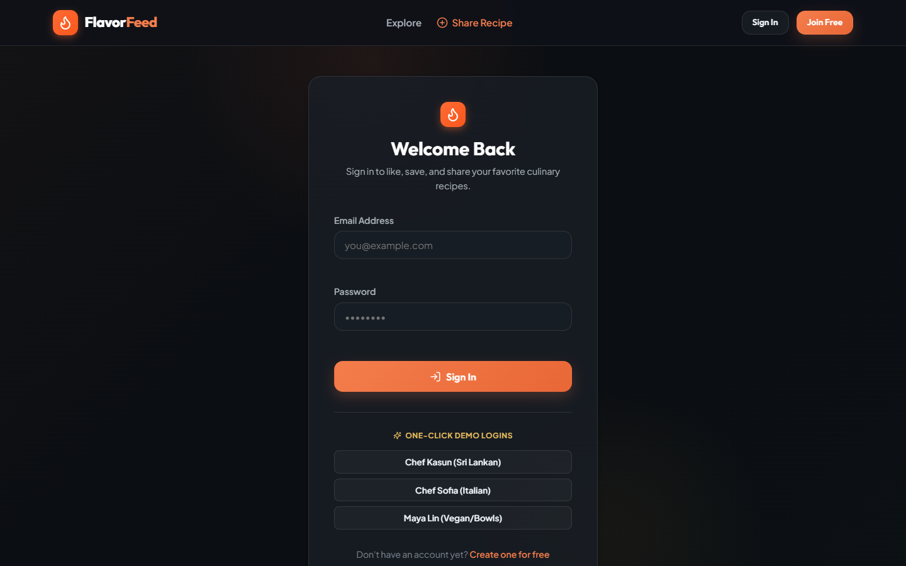

<div align="center">

# 🍳 FlavorFeed — Interactive Recipe Social Network

> A modern, high-performance Single Page Application (SPA) built for culinary enthusiasts, home cooks, and artisan bakers to discover authentic recipes, scale servings dynamically, cook with live step timers, and build personal digital cookbooks.

[](#technology-stack)
[-yellow.svg)](#technology-stack)
[](#technology-stack)
[](#technology-stack)
[](#technology-stack)
[](#technology-stack)
[](https://flavorfeed-interactive-recipe-social-network.vercel.app)
[](#license)

### 🌐 Live Production URL (Available 24/7)
**Live Web Application:** [https://flavorfeed-interactive-recipe-social-network.vercel.app](https://flavorfeed-interactive-recipe-social-network.vercel.app)

[](https://vercel.com/new/clone?repository-url=https%3A%2F%2Fgithub.com%2Fgajinduyashmika%2FFlavorFeed-Interactive-Recipe-Social-Network&branch=dev)

---

</div>

## 📑 Table of Contents
- [Project Overview](#-project-overview)
- [Visual Showcase & Screen Walkthrough](#-visual-showcase--screen-walkthrough)
  - [1. Discovery Feed & Search](#1-discovery-feed--search)
  - [2. Interactive Recipe Detail](#2-interactive-recipe-detail)
  - [3. Dynamic Servings Scaler & Prep Checklist](#3-dynamic-servings-scaler--prep-checklist)
  - [4. Guided Cook Mode with Step Timers](#4-guided-cook-mode-with-step-timers)
  - [5. Celebration & Plating Milestone](#5-celebration--plating-milestone)
  - [6. Recipe Creator & Image Uploader](#6-recipe-creator--image-uploader)
  - [7. Foodie Profile & Digital Cookbooks](#7-foodie-profile--digital-cookbooks)
  - [8. Authentication & 1-Click Demo Logins](#8-authentication--1-click-demo-logins)
- [Core Features & SRS Compliance](#-core-features--srs-compliance)
- [Culinary Innovations](#-culinary-innovations)
- [Architecture & Folder Structure](#-architecture--folder-structure)
- [REST API Reference](#-rest-api-reference)
- [Installation & Quickstart Guide](#-installation--quickstart-guide)
- [Automated Integration Test Suite](#-automated-integration-test-suite)
- [Contributors & Commit Workflow](#-contributors--commit-workflow)

---

## 🌟 Project Overview

**FlavorFeed** bridges the gap between static recipe databases and vibrant social communities. Built on the **MERN stack (MongoDB, Express.js, React.js, Node.js)** strictly using **pure JavaScript** (no TypeScript) with **Vanilla CSS design system**, it delivers a rich culinary experience:

- **Rich Document Model**: Leverages MongoDB's flexible schema for variable ingredients, cooking steps, nested reviews, and dynamic likes.
- **Zero-Setup Local Execution**: Features an automatic fallback to embedded in-memory MongoDB (`mongodb-memory-server`) if no local database is running, guaranteeing immediate out-of-the-box functionality.
- **Interactive Culinary Engine**: Real-time ingredient proportion calculation, step timers, checklist strikethroughs, and distraction-free cooking modes.

---

## 📸 Visual Showcase & Screen Walkthrough

### 1. Discovery Feed & Search
The main discovery hub featuring a hero banner, real-time debounced multi-field search (title, cuisine, and ingredients), category filter pills (*Sri Lankan, Italian, Curry, Vegan, Dessert, Street Food, Quick & Easy*), and responsive masonry cards.

<div align="center">
  
</div>

---

### 2. Interactive Recipe Detail
Presents the dish with hero media, difficulty and cuisine tags, author profile link, star ratings (1–5 stars), like counter, cookbook bookmarking, and quick cooking metrics.

<div align="center">
  
</div>

---

### 3. Dynamic Servings Scaler & Prep Checklist
Cooks can adjust serving sizes on the fly (+ / - buttons). Ingredient amounts automatically scale with clean decimal precision. Clicking any ingredient marks it as gathered (*Mise en Place*) with a strikethrough.

<div align="center">
  
</div>

---

### 4. Guided Cook Mode with Step Timers
A full-screen, high-contrast modal guiding the cook through every instruction step with a live progress bar, step counter, and built-in countdown timers that support play, pause, reset, and Web Audio melodic chimes.

<div align="center">
  
</div>

---

### 5. Celebration & Plating Milestone
Completing the final step triggers a celebration screen with real-time confetti physics (`canvas-confetti`) congratulating the cook.

<div align="center">
  
</div>

---

### 6. Recipe Creator & Image Uploader
A multi-section authoring studio allowing foodies to publish recipes with Title, Description, Prep & Cook Times, Servings, Skill Difficulty, Cuisine, drag-and-drop Image Upload (via **Multer**), dynamic Ingredients builder, and timed Instruction steps.

<div align="center">
  
</div>

---

### 7. Foodie Profile & Digital Cookbooks
Profile page displaying member credentials, custom bio, member join date, and live statistics (*Recipes Shared, Cookbook Saves, Likes Received*). Includes tabbed navigation between **Shared Recipes** and **Personal Cookbooks**.

<div align="center">
  
</div>

---

### 8. Authentication & 1-Click Demo Logins
Secure JWT login form with HTTP-only cookies and one-click demo login buttons for **Chef Kasun (Sri Lankan)**, **Chef Sofia (Italian)**, and **Maya Lin (Vegan/Bowls)** for rapid evaluation without typing.

<div align="center">
  
</div>

---

## 🎯 Core Features & SRS Compliance

| Requirement ID | Specification | Implementation Detail |
|---|---|---|
| **FR-1.1** | User Authentication & Session Security | JWT tokens issued on register/login and stored in secure HTTP-only cookies (`sameSite: lax`). Passwords encrypted with `bcryptjs`. |
| **FR-1.2** | User Profile & Digital Cookbooks | Dedicated profile view (`/profile/:id`) showcasing authored recipes and saved bookmarks with live aggregate stats. |
| **FR-2.1** | Recipe Document Authoring | Structured recipe schema containing Title, Description, Prep/Cook Time, Servings, Difficulty, Cuisine, Categories, Ingredients, and Instructions. |
| **FR-2.2** | Image Upload Support | Express backend uses `multer` diskStorage to handle multipart/form-data with file validation (JPG, PNG, WEBP, GIF up to 5MB). |
| **FR-2.3** | Recipe Modification & Deletion | Only authors can edit or delete their recipes. Local uploaded image files are cleaned up from disk upon deletion. |
| **FR-3.1** | Dynamic Like Toggle | Real-time optimistic UI update for likes with atomic `$pull` / `$addToSet` in MongoDB and dynamic like count. |
| **FR-3.2** | Community Comment Thread | Sub-document comment array storing commenter profile, timestamp, and text with deletion permissions for comment and recipe authors. |
| **FR-4.1** | Multi-Field Search & Discovery | Real-time debounced search bar querying titles, descriptions, cuisines, categories, and ingredient names. |
| **FR-4.2** | Database Text Indexing | MongoDB `$regex` and multi-field text indexing on `Recipe` collection for high-performance discovery. |

---

## 💡 Culinary Innovations

1. **Interactive Servings Scaler**: Automatically recalculates proportions for any number of guests (1–50 servings) with intelligent integer and decimal formatting.
2. **Mise en Place Checklist**: Cooks can tap each ingredient to check it off with a strike-through as ingredients are prepared.
3. **Full-Screen Distraction-Free Cook Mode**: Large, high-legibility typography designed for hands-free kitchen tablet/phone use with automated step countdown timers.
4. **Web Audio Melodic Chimes**: Synthesizes a gentle dual-frequency chime when baking/simmering timers finish.
5. **Interactive 1–5 Star Rating System**: Allows community members to submit ratings, dynamically computing average star ratings and total review counts.
6. **Print-Friendly Recipe View**: Customized `@media print` styling that formats the recipe onto a clean chef prep card suitable for physical printing or PDF export.

---

## 🏗️ Architecture & Folder Structure

FlavorFeed enforces a clean separation of concerns between `backend/` and `frontend/` directories:

```
recipe_network/
├── .gitignore
├── README.md                          # Comprehensive documentation & visual showcase
├── package.json                       # Monorepo runner scripts
├── docs/
│   └── screenshots/                   # 8 high-resolution application screenshots
│       ├── 01_home_feed.png
│       ├── 02_recipe_detail_hero.png
│       ├── 03_recipe_servings_scaler.png
│       ├── 04_cook_mode_active.png
│       ├── 05_cook_mode_completed.png
│       ├── 06_create_recipe.png
│       ├── 07_foodie_profile.png
│       └── 08_auth_login.png
├── backend/
│   ├── .env.example                   # Environment configuration template
│   ├── package.json                   # Backend dependencies (Express, Mongoose, Multer)
│   ├── server.js                      # Express app entry, CORS, and middleware mounting
│   ├── test_e2e.js                    # Automated integration test runner
│   ├── capture_screenshots.js         # Automated UI screenshot capture script
│   ├── config/
│   │   └── db.js                      # MongoDB connection with auto MongoMemoryServer fallback
│   ├── controllers/
│   │   ├── authController.js          # Authentication, JWT cookies, profile updates
│   │   ├── recipeController.js        # Recipe CRUD, search, likes, comments, ratings
│   │   └── userController.js          # User profile stats and saved cookbooks
│   ├── middleware/
│   │   ├── auth.js                    # JWT verification (cookies & Authorization header)
│   │   ├── errorHandler.js            # Centralized error handler
│   │   └── upload.js                  # Multer disk storage and file filter
│   ├── models/
│   │   ├── Recipe.js                  # Recipe schema with text search indexes
│   │   └── User.js                    # User schema with bcrypt encryption
│   ├── routes/
│   │   ├── authRoutes.js
│   │   ├── recipeRoutes.js
│   │   └── userRoutes.js
│   └── seed/
│       ├── autoSeed.js                # Auto-seeder on database boot
│       └── seedData.js                # Seed script with gourmet recipes & demo chefs
└── frontend/
    ├── index.html                     # HTML5 template with Outfit & Plus Jakarta Sans
    ├── package.json                   # Frontend dependencies (React 18, Vite, Lucide)
    ├── vite.config.js                 # Vite configuration with backend proxy
    └── src/
        ├── main.jsx                   # React root entry point
        ├── App.jsx                    # Client route definitions
        ├── index.css                  # Custom design system tokens & animations
        ├── api/
        │   └── client.js              # Fetch wrapper with cookie credentials
        ├── context/
        │   ├── AuthContext.jsx         # Global user session state & hydration
        │   └── ToastContext.jsx        # Floating notifications system
        ├── components/
        │   ├── Navbar.jsx             # Top navigation with profile dropdown
        │   ├── Footer.jsx             # Footer with categories and links
        │   ├── RecipeCard.jsx         # Card with like/save toggles & tags
        │   ├── RecipeFilter.jsx       # Search input, category pills, sort dropdown
        │   ├── ServingsScaler.jsx     # Proportional scaler & ingredient checklist
        │   ├── CookModeModal.jsx      # Distraction-free cook walkthrough with timers
        │   ├── StarRating.jsx         # Interactive 1–5 star rater
        │   ├── CommentSection.jsx     # Discussion feed with creator badges
        │   └── ImageUpload.jsx        # Drag-and-drop file upload & URL preview
        └── pages/
            ├── HomePage.jsx           # Hero, filter controls, recipe feed
            ├── RecipeDetailPage.jsx   # Recipe presentation, scaler, comments
            ├── CreateRecipePage.jsx   # Recipe authoring form
            ├── EditRecipePage.jsx     # Recipe editing form
            ├── ProfilePage.jsx        # Profile details, shared & saved tabs
            ├── LoginPage.jsx          # Login & 1-click demo logins
            └── RegisterPage.jsx       # New foodie registration
```

---

## 📡 REST API Reference

| Method | Endpoint | Description | Auth Required |
|---|---|---|---|
| `GET` | `/api/health` | Server health check | No |
| `POST` | `/api/auth/register` | Register new foodie account | No |
| `POST` | `/api/auth/login` | Authenticate and set HTTP-only cookie | No |
| `POST` | `/api/auth/logout` | Clear user session cookie | Yes |
| `GET` | `/api/auth/me` | Fetch authenticated user profile | Yes |
| `PUT` | `/api/auth/profile` | Update profile bio, name, or avatar | Yes |
| `GET` | `/api/recipes` | List recipes with search, category, sort | Optional |
| `GET` | `/api/recipes/:id` | Retrieve single recipe document | Optional |
| `POST` | `/api/recipes` | Create new recipe (Multipart or JSON) | Yes |
| `PUT` | `/api/recipes/:id` | Update authored recipe | Yes |
| `DELETE` | `/api/recipes/:id` | Delete authored recipe and clean up image | Yes |
| `PUT` | `/api/recipes/:id/like` | Toggle recipe like status | Yes |
| `PUT` | `/api/recipes/:id/save` | Toggle recipe in personal cookbook | Yes |
| `POST` | `/api/recipes/:id/comments` | Post comment on recipe | Yes |
| `DELETE` | `/api/recipes/:id/comments/:cId` | Delete comment (commenter or author) | Yes |
| `POST` | `/api/recipes/:id/rate` | Submit 1–5 star rating | Yes |
| `GET` | `/api/users/profile/:id` | Fetch user profile, creations & cookbook | Optional |

---

## ⚡ Installation & Quickstart Guide

### Prerequisites
- [Node.js](https://nodejs.org/) (v18.0.0 or higher recommended)
- [npm](https://www.npmjs.com/) (v9.0.0 or higher)
- *MongoDB is optional!* The backend automatically runs an embedded in-memory MongoDB instance if no local MongoDB service is detected.

### 1. Clone the Repository
```bash
git clone -b dev https://github.com/gajinduyashmika/FlavorFeed-Interactive-Recipe-Social-Network.git
cd FlavorFeed-Interactive-Recipe-Social-Network
```

### 2. Install All Dependencies
From the project root directory:
```bash
npm run install:all
```
*Or install separately:*
```bash
cd backend && npm install
cd ../frontend && npm install
```

### 3. Configure Environment (Optional)
The backend already includes pre-configured defaults in `backend/.env`. If you wish to connect to a custom local MongoDB or MongoDB Atlas cluster:
```env
PORT=5000
NODE_ENV=development
MONGODB_URI=mongodb://localhost:27017/flavorfeed
JWT_SECRET=flavorfeed_super_secret_jwt_key_2026_recipe_network
FRONTEND_URL=http://localhost:5173
```

### 4. Start the Application
Open two terminal windows:

**Terminal 1 — Backend Server:**
```bash
cd backend
npm run dev
```
*Server boots on `http://localhost:5000` and automatically populates demo culinary data if empty.*

**Terminal 2 — Frontend Application:**
```bash
cd frontend
npm run dev
```
*Vite dev server starts on `http://localhost:5173` with automatic proxying.*

### 5. Access FlavorFeed in Your Browser
Open [http://localhost:5173](http://localhost:5173) in your web browser.

---

## 🧪 Automated Integration Test Suite

FlavorFeed includes an automated end-to-end integration test runner validating all 11 critical flows against the running Express server and MongoDB database:

```bash
# Run from root directory
npm run test:e2e
```

**Verification Output:**
```text
🚀 Starting FlavorFeed End-to-End Verification...

✅ 1. Health Check: healthy
✅ 2. Recipes Feed: Retrieved 6 recipes (Total: 6)
   Featured Recipe: "Artisanal Sourdough Pizza Margherita" (Italian)
✅ 3. Category Filter (Sri Lankan): Found 3 matching recipes
✅ 4. Search Filter ('pork'): Found 1 matching recipes
✅ 5. Auth Login: Authenticated Chef "Chef Kasun Silva"
✅ 6. Toggle Like: Status: isLiked=false, Total Likes=1
✅ 7. Toggle Save to Cookbook: Recipe removed from cookbook.
✅ 8. Post Comment: Success! Latest: "Incredible roasted spice aroma! Tried it with steamed samba rice."
✅ 9. Star Rating: Average Rating=5 (2 ratings)
✅ 10. Recipe CRUD (Create): Created recipe "Traditional Sri Lankan Pol Roti with Lunu Miris"
✅ 11. Profile & Cookbooks: User has 4 authored recipes and 1 saved in cookbook

🎉 ALL 11 END-TO-END CRITICAL FLOWS VERIFIED SUCCESSFULLY!
```

---

## ☁️ Cloud Deployment on Vercel

FlavorFeed is architected with **Zero-Config Serverless Deployment** on Vercel:

1. **Frontend**: Vite compiles into `frontend/dist`, cached globally across Vercel Edge Network.
2. **Backend**: Express REST API runs as a serverless function via `api/index.js` rewriting all `/api/*` requests.
3. **Database**: Connected directly to persistent **MongoDB Atlas** (`cluster0.4zl9uw0.mongodb.net`) with connection pooling.

### 1-Click Deploy to Vercel:
[](https://vercel.com/new/clone?repository-url=https%3A%2F%2Fgithub.com%2Fgajinduyashmika%2FFlavorFeed-Interactive-Recipe-Social-Network&branch=dev)

### Manual Vercel Deployment via CLI:
```bash
# Deploy to preview
vercel

# Deploy to production
vercel --prod
```

---

## 👥 Contributors & Commit Workflow

This project is collaboratively developed on the `dev` branch by:

| Developer | Name | GitHub Username | Email |
|---|---|---|---|
| **Lead Developer 1** | Gajindu Yashmika | [`gajinduyashmika`](https://github.com/gajinduyashmika) | `yashmika6969@gmail.com` |
| **Lead Developer 2** | Chamini Amanda | [`chaminiamanda`](https://github.com/chaminiamanda) | `chaminiamanda7@gmail.com` |

---

## 📄 License
This project is licensed under the [MIT License](LICENSE).
